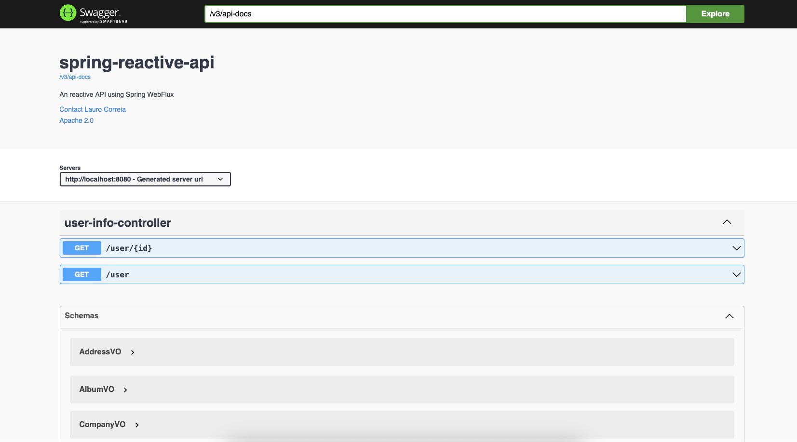
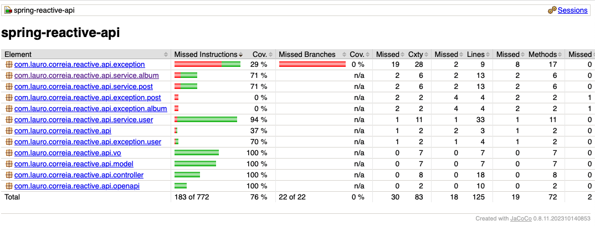

# spring-reactive-api

## Content
* [Introduction](#introduction)
* [Setup](#setup)
* [Documentation](#documentation)
* [Hot to run](#how-to-run)
* [Test Coverage by Jacoco Reporter](#test-coverage)
* [To do List](#to-do-list)
* [Contributors](#Contributors)
* [License](#license)

### Introduction
To learn more about asynchronous programming I decided to create an API using Spring WebFlux.
But what does this API do? Basically, there are currently three endpoints to list all users and another to obtain complete user information with their books, albums and posts.

### Setup

To be able to run the project locally you need to have it configured on your computer.
- JDK 17 at least
- Maven 3.8
- Terminal of your choice


### Techinologies
- Java 21
- Spring Boot 3.3.1
- Spring WebFlux
- Spring OpenAPI
- Swagger 
- Maven 3.8.6
- Docker
- Jacoco Reporter
- Mapstruct

### Documentation
the project is documented using Spring OpenAPI.
This Spring Framework starter allows us to generate Swagger documentation for all endpoints, you just have to access the url http://localhost:8080/webjars/swagger-ui.html.
After access the url, you will see:



### How to run
First you have to clone the repository.
``
https://github.com/LauroSilveira/spring-reactive-api.git
``
Change directory to where you downloaded and execute:

```
mvn clean install
```

This will install all dependencies in you .m2.

After it executes the following command:

```
mvn spring-boot:run
```

#### Run with Docker Compose
Se você tiver o Docker e o Docker compose instalados, poderá executá-lo simplesmente executando `docker-compose up`

### Test Coverage by Jacoco Reporter
currently the code coverage rate is not complete.
However, it is planned to go up.
It is possible to see using the Jacoco reporter plugin.



## Contributors
[@LauroSilveira](https://github.com/LauroSilveira)

## License
[MIT](https://choosealicense.com/licenses/mit/)

